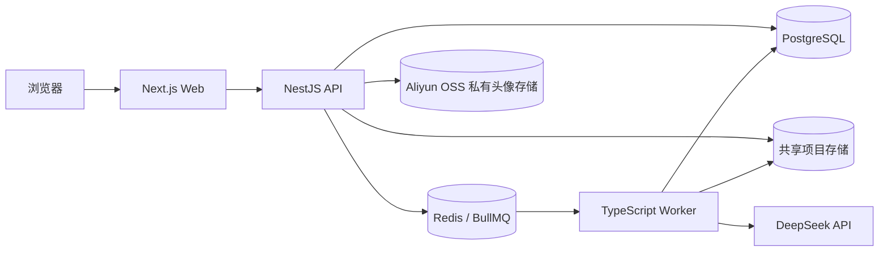

# HireScope AI

HireScope AI 是面向开发者的 AI 项目审查与模拟面试平台。当前仓库实现 User 端 MVP：用户上传 ZIP 项目后，系统异步完成项目分析、代码审查、面试题生成与面试报告评分，并在 Web 工作台展示全过程结果。

## 核心功能

- 注册、登录、刷新会话与退出登录
- ZIP 项目上传、格式/大小/路径安全校验与项目归属校验
- 技术栈、目录结构、入口文件和核心模块分析
- 基于真实项目文件证据的 AI 代码审查
- 基于项目与审查结果的 AI 模拟面试、逐题作答和自动保存
- 结构化面试评分、能力维度汇总、改进建议与报告重试
- 异步任务状态查询、失败信息记录、恢复与幂等处理
- AI 调用日志记录，避免记录密钥和完整源码

## 架构



生产 Compose 仅对宿主机发布 Web 端口。Web 通过内部 `API_ORIGIN` 转发 `/api/*`；API、Worker、PostgreSQL 和 Redis 只在 Compose 网络中通信。API 与 Worker 以同一 UID 访问共享 `storage_data` 卷，上传文件不会写入容器临时层。

## 技术栈

| 层 | 技术 |
| --- | --- |
| Web | Next.js 16、React 19、TypeScript |
| API | NestJS 11、Prisma 6、Passport/JWT、Argon2 |
| Worker | Node.js 22、TypeScript、BullMQ |
| 数据与队列 | PostgreSQL 16、Redis 7 |
| 对象存储 | Aliyun OSS 私有 Bucket、短期签名 URL |
| AI | DeepSeek OpenAI-compatible API、结构化 JSON 校验、确定性回退 |
| 测试 | Vitest、Supertest、Playwright、真实 PostgreSQL/Redis 集成测试 |
| 工程化 | pnpm workspace、Docker Compose、GitHub Actions |

## 异步任务可靠性

API 先持久化业务对象和 `async_tasks`，成功入队后再推进队列状态。Worker 对项目分析、项目清理、代码审查、面试题和面试报告任务执行幂等状态迁移，并在启动及固定间隔扫描以下异常任务：

- 长时间停留在 `PENDING` 的任务重新入队；
- 超过阈值的 `QUEUED` 或 `PROCESSING` 任务按恢复次数重新调度；
- 达到 `TASK_RECOVERY_MAX_ATTEMPTS` 后写入稳定失败状态，避免无限重试；
- Redis 入队失败时保留可恢复状态，不把未入队任务误报为已排队；
- Worker 收到 `SIGTERM`/`SIGINT` 后关闭 BullMQ、Prisma 与定时恢复任务。

生产环境可通过 `TASK_RECOVERY_*` 调整扫描间隔、批量大小、超时和最大恢复次数。扩容 Worker 前需确认任务处理器的幂等边界，并持续观察数据库任务积压和 BullMQ 失败事件。

## AI 审查与面试评分

Worker 不会把整个项目无界发送给模型。代码审查上下文由受控的目录、入口、配置、测试与代表性源码片段组成，排除 `.git`、`node_modules`、构建目录和常见敏感目录；模型引用的路径必须来自允许的 `evidencePaths`，无效结构、虚构路径或与已知测试文件矛盾的结论会被拒绝。

面试题同样绑定真实项目证据。面试报告使用服务端生成的加权 Rubric：AI Judge 只判定评分点是否覆盖并返回答案中的原句证据，最终分数由服务端计算。证据必须逐字存在于用户答案，低质量短答和关键词堆砌受分数上限约束；AI 输出无效或上游不可用时使用确定性评分回退。所有重要 AI 调用记录 provider、model、prompt/schema version、token/latency 和结果状态，但不记录 API Key。

## 本地开发

要求：Node.js 22、pnpm 11.7.0、Docker Engine / Docker Desktop。

```powershell
Copy-Item .env.example .env
pnpm install --frozen-lockfile
pnpm infra:up
pnpm db:generate
pnpm db:deploy
pnpm api:dev
pnpm worker:dev
pnpm --filter @hirescope/web dev -- --port 4200
```

默认示例使用 Web `4200`、API `4201`。若修改端口，必须同步调整 `.env` 中的 `API_PORT`、`CORS_ALLOWED_ORIGINS`，以及 Web 进程的 `API_ORIGIN`。

## 生产 Docker 启动

这是一套单机 Docker Compose 发布基线，不包含云资源创建、域名、TLS 证书、监控平台或自动备份。当前示例支持通过 `http://114.55.102.140:3000` 直接访问；上线后仍建议尽快接入 TLS 和持久化备份。

1. 创建真实生产环境文件并设置仅属主可读权限：

   ```bash
   cp .env.production.example .env.production
   chmod 600 .env.production
   ```

2. 替换全部示例占位值，包括 `replace_with_*` 和 `replace-with-private-bucket`；保证 `POSTGRES_PASSWORD` 与 `DATABASE_URL`、`REDIS_PASSWORD` 与 `REDIS_URL` 一致。URL 中的特殊字符必须进行 percent-encoding。OSS 应使用私有 Bucket 和仅允许头像对象读写的最小权限凭据。
3. 直连公网 IP 时使用 `CORS_ALLOWED_ORIGINS=http://114.55.102.140:3000`、`AUTH_COOKIE_SECURE=false`、`AUTH_COOKIE_NAME=hirescope_refresh`、`TRUST_PROXY_HOPS=0` 和 `WEB_BIND_ADDRESS=0.0.0.0`。若改为 HTTPS 反向代理，则把 Origin 改为精确 HTTPS 地址，设置 `AUTH_COOKIE_SECURE=true`、使用 `__Secure-` Cookie 名，并让 `TRUST_PROXY_HOPS` 等于可信代理的实际跳数。
4. 校验配置并构建镜像：

   ```bash
   docker compose --env-file .env.production -f docker-compose.prod.yml config
   docker compose --env-file .env.production -f docker-compose.prod.yml build
   ```

5. 先启动基础设施并执行迁移，再启动应用：

   ```bash
   docker compose --env-file .env.production -f docker-compose.prod.yml up -d postgres redis storage-init
   docker compose --env-file .env.production -f docker-compose.prod.yml --profile migration run --rm migrate
   docker compose --env-file .env.production -f docker-compose.prod.yml up -d api worker web
   docker compose --env-file .env.production -f docker-compose.prod.yml ps
   ```

6. 访问 `http://114.55.102.140:3000`，并检查容器日志：

   ```bash
   docker compose --env-file .env.production -f docker-compose.prod.yml logs --tail=200 api worker web
   ```

升级时先备份 PostgreSQL、Redis AOF 和 `storage_data`，拉取已验收提交后重新构建，执行 `migrate`，再滚动重建应用容器。不要运行 `prisma migrate dev` 或 `db:reset`。

### 健康检查

| 服务 | 检查方式 | 说明 |
| --- | --- | --- |
| PostgreSQL | `pg_isready` | 容器接受数据库连接 |
| Redis | 带认证的 `redis-cli ping` | Redis 可用且密码匹配 |
| API | 请求 `/api/v1/auth/me` | 未登录返回 `401` 仍表示 HTTP 进程存活；不等同于完整依赖就绪 |
| Worker | PID 1 存活检查 | 配合 BullMQ 失败日志与任务积压监控；当前无独立 readiness 端点 |
| Web | 请求 `/` | Next.js HTTP 服务可响应 |

## 生产环境变量

完整模板见 [`.env.production.example`](.env.production.example)。关键分组如下：

| 分组 | 变量 |
| --- | --- |
| 暴露端口 | `WEB_BIND_ADDRESS`、`WEB_PORT` |
| PostgreSQL | `POSTGRES_DB`、`POSTGRES_USER`、`POSTGRES_PASSWORD`、`DATABASE_URL` |
| Redis / BullMQ | `REDIS_PASSWORD`、`REDIS_URL`、`REDIS_COMMAND_TIMEOUT_MS`、`TASK_QUEUE_NAME` |
| 持久化与安全限额 | `STORAGE_ROOT`、`ZIP_MAX_*`、`ANALYSIS_MAX_TEXT_READ_BYTES` |
| 任务恢复 | `TASK_RECOVERY_INTERVAL_MS`、`TASK_RECOVERY_BATCH_SIZE`、`TASK_RECOVERY_QUEUED_TIMEOUT_MS`、`TASK_RECOVERY_PROCESSING_TIMEOUT_MS`、`TASK_RECOVERY_MAX_ATTEMPTS` |
| DeepSeek | `AI_BASE_URL`、`AI_API_KEY`、`AI_MODEL` |
| Aliyun OSS | `OSS_ACCESS_KEY_ID`、`OSS_ACCESS_KEY_SECRET`、`OSS_BUCKET`、`OSS_REGION`、`OSS_SIGNED_URL_TTL_SECONDS` |
| API / 代理 | `NODE_ENV`、`API_HOST`、`API_PORT`、`API_ORIGIN`、`CORS_ALLOWED_ORIGINS`、`TRUST_PROXY_HOPS` |
| Auth | `JWT_*`、`AUTH_REFRESH_*`、`AUTH_COOKIE_SECURE`、`AUTH_COOKIE_NAME`、`AUTH_DUMMY_PASSWORD_HASH`、`AUTH_ARGON2_*`、`AUTH_*_WINDOW_SECONDS`、`AUTH_*_MAX_REQUESTS` |

`AI_BASE_URL`、`AI_API_KEY`、`AI_MODEL` 必须同时设置。Cookie 安全策略由 `AUTH_COOKIE_SECURE` 显式控制，不再由 `NODE_ENV` 推断。HTTP Origin 必须显式包含端口，并搭配 `AUTH_COOKIE_SECURE=false` 和不带 `__Secure-` 前缀的 Cookie 名；CORS 始终使用精确白名单并保留凭据，禁止 `*`。HTTP 会明文传输会话流量，仅适合作为当前部署过渡方案。

## 验证与测试

当前基线为 `origin/main` 的 `5ac5949`。该提交的 GitHub Actions `Full validation` 已通过，覆盖：

- Prisma Schema 校验与 Client 生成；
- Shared Types、Web、API、Worker 单元测试；
- Web lint/typecheck/build、API typecheck/build、Worker typecheck/build；
- API E2E、Worker 集成、浏览器 MVP E2E；
- PostgreSQL 数据库约束测试。

本发布准备分支另行完成了以下本地验证：Shared Types `7` 项、API `89` 项、Web `139` 项、Worker `101` 项单元测试全部通过；Prisma Schema 校验、三端 typecheck/build 与 Web lint 通过（lint 保留 2 条既有 `` 优化 warning，无 error）。生产 Compose 的 `migrate`、`api`、`worker`、`web` 四个镜像目标构建成功，实际应用 3 条 migration，并完成五个核心服务健康检查、共享存储写权限、首页 `200`、API 代理未登录 `401`；Web 容器未注入数据库、Redis、JWT、Refresh、DeepSeek 或 OSS 密钥。

发布前建议至少执行：

```bash
pnpm db:validate
pnpm --filter @hirescope/shared-types test
pnpm --filter @hirescope/web lint
pnpm --filter @hirescope/web typecheck
pnpm --filter @hirescope/web test
pnpm --filter @hirescope/web build
pnpm api:typecheck
pnpm api:test
pnpm api:build
pnpm worker:typecheck
pnpm worker:test
pnpm worker:build
docker compose --env-file .env.production -f docker-compose.prod.yml config
docker compose --env-file .env.production -f docker-compose.prod.yml build
```

需要真实 PostgreSQL、Redis 或浏览器的 E2E / 集成测试按 [`.github/workflows/ci.yml`](.github/workflows/ci.yml) 的隔离测试环境执行。

## 截图位置

- 自动化验收截图：[`tests/e2e/screenshots`](tests/e2e/screenshots)
- 首页、工作台、产品能力、流程、报告等设计参考：[`imgs`](imgs)

当前自动化截图包括浅色面试报告、深色面试报告和报告失败重试状态。截图是验收证据，不进入生产镜像。

## 安全与运维边界

- `.env`、`.env.production`、上传文件、日志、构建产物、测试产物和本地 Codex 文件均被忽略；提交前仍需执行密钥扫描。
- PostgreSQL、Redis 和 API 不发布宿主机端口；只允许 Web 经可信 TLS 反向代理对外服务。
- Compose 提供命名卷，但不提供备份、跨主机高可用、集中日志、指标告警和密钥管理。生产使用时应接入组织现有设施。
- DeepSeek Key、JWT Secret、Refresh Hash Secret、数据库密码和 Redis 密码必须由部署平台注入，不得写入镜像、Compose 或 Git。
- User 端 MVP 不包含 Admin / Interviewer 后台，也不应从本发布准备分支扩展业务范围。
