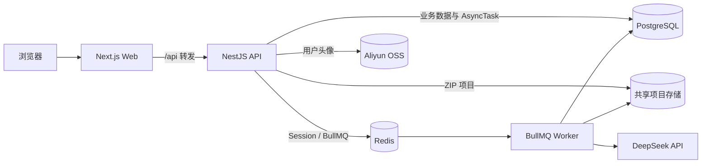

# HireScope AI

## 项目简介

HireScope AI 是一个面向开发者的 AI 项目代码审查与模拟面试平台。当前仓库实现 User 端 PC MVP：用户上传 ZIP 项目后，系统异步完成项目分析、代码审查、面试题生成与面试报告评分，并通过 Web 工作台展示任务状态和结构化结果。

项目采用 pnpm Monorepo，将界面、业务 API、异步 Worker、共享契约和数据层分离，重点解决长耗时 AI 任务的可靠调度、结果校验与失败恢复。

## 核心功能

- 用户注册、登录、会话刷新、退出登录、密码修改与头像管理
- ZIP 项目上传，以及文件类型、大小、解压路径和资源归属校验
- 技术栈、目录结构、入口文件、核心模块和项目统计分析
- 基于真实项目文件证据的 AI 代码审查与结构化评分
- 基于项目和审查结果的模拟面试、逐题作答与答案自动保存
- 面试报告生成、能力维度汇总、逐题反馈和失败重试
- 异步任务状态查询、失败信息记录、任务恢复与项目异步删除

## 技术栈

| 层 | 技术 |
| --- | --- |
| 运行时与 Monorepo | Node.js 22、pnpm 11.7.0、TypeScript 5.9 |
| Web | Next.js 16、React 19 |
| API | NestJS 11、Prisma 6、Passport/JWT、Argon2 |
| Worker | BullMQ 5、ioredis、TypeScript |
| 数据 | PostgreSQL 16、Redis 7 |
| AI | DeepSeek OpenAI-compatible API、Zod / Shared Schema |
| 存储 | 共享项目文件存储、Aliyun OSS 私有头像存储 |
| 测试 | Vitest、Supertest、Playwright、PostgreSQL/Redis 集成测试 |
| 工程化 | Docker Compose、GitHub Actions |

## 系统架构


```mermaid
flowchart LR
  Browser[浏览器] --> Web[Next.js Web]
  Web -->|/api 转发| API[NestJS API]
  API -->|业务数据与 AsyncTask| PostgreSQL[(PostgreSQL)]
  API -->|Session / BullMQ| Redis[(Redis)]
  API -->|ZIP 项目| Storage[(共享项目存储)]
  API -->|用户头像| OSS[(Aliyun OSS)]
  Redis --> Worker[BullMQ Worker]
  Worker --> PostgreSQL
  Worker --> Storage
  Worker --> DeepSeek[DeepSeek API]
```

Web 负责页面与 API 转发，NestJS API 负责认证、权限、业务事务和任务入队；Worker 执行项目分析、代码审查、面试题、报告与文件清理等长任务。PostgreSQL 保存业务事实和任务状态，Redis 承载 Session、认证限流与 BullMQ。

## 技术亮点

- **异步任务架构**：NestJS API 将长耗时工作交给 BullMQ，独立 Worker 消费项目分析、代码审查、面试题、报告和清理任务，避免阻塞请求链路。
- **清晰的数据职责**：PostgreSQL 是项目、审查、面试、报告和任务状态的业务事实源；Redis 用于 Session、认证限流和 BullMQ 的队列状态，不替代业务持久化。
- **任务可靠性**：API 先持久化业务对象和 `AsyncTask`，再发布队列消息；以 `taskId` 作为固定 `jobId`，结合唯一约束、条件更新、事务行锁和幂等处理抑制重复执行。Worker 会恢复滞留任务、限制恢复次数，并在项目删除竞态中取消进行中的业务任务。
- **受控 AI 上下文**：只向模型发送经过筛选、限量的目录、配置、测试和源码片段；AI 结果经过 Zod / Schema 校验，引用路径必须来自真实 `evidencePaths`。无效 JSON、虚构证据或上游失败会触发重试或 deterministic fallback。
- **会话安全**：短期 JWT Access Token 配合 HttpOnly Refresh Cookie；Redis 保存服务端 Session 和 Refresh Token Hash，Refresh Token Rotation 通过 Lua 脚本原子执行，登出和修改密码可撤销会话。

## 项目结构

```text
.
├─ apps/
│  ├─ web/                 # Next.js 页面、交互与 API 转发
│  ├─ api/                 # NestJS API、认证与业务服务
│  └─ worker/              # BullMQ Worker、AI 与项目分析
├─ packages/
│  └─ shared-types/        # 跨端类型与 Zod Schema
├─ prisma/                 # Prisma Schema 与数据库测试
├─ tests/e2e/              # Playwright MVP 端到端测试
├─ docs/                   # 阅读、测试与生产部署文档
├─ .github/workflows/      # CI 与镜像发布流程
├─ docker-compose.yml      # 本地 PostgreSQL / Redis
└─ docker-compose.prod.yml # 单机生产 Compose 基线
```

## 快速开始

环境要求：Node.js 22、pnpm 11.7.0、Docker Engine 或 Docker Desktop。

本地配置从 [`.env.example`](.env.example) 创建；生产配置入口为 [`.env.production.example`](.env.production.example)。请替换模板中的必要占位值，不要提交真实 `.env`、密钥或上传文件。

```powershell
Copy-Item .env.example .env
pnpm install --frozen-lockfile
pnpm infra:up
pnpm db:generate
pnpm db:deploy
```

分别启动 API、Worker 和 Web：

```powershell
pnpm api:dev
pnpm worker:dev
pnpm --filter @hirescope/web dev -- --port 4200
```

默认本地地址为 Web `http://localhost:4200`、API `http://localhost:4201`。修改端口时需同步调整 `.env` 中的 API、CORS 和 Web 转发配置。

常用数据库命令：

```powershell
pnpm db:validate
pnpm db:generate
pnpm db:deploy
```

生产环境只使用 `pnpm db:deploy`，不得运行 `db:migrate` 或 `db:reset`。

## 测试

| 范围 | 说明 |
| --- | --- |
| 单元测试 | Vitest 覆盖 Shared Types、Web、API 与 Worker |
| API E2E | Supertest 验证 HTTP、认证、权限与业务接口 |
| Worker Integration | 在隔离 PostgreSQL/Redis 环境验证队列处理与持久化 |
| 浏览器 E2E | Playwright 覆盖 User 端核心 MVP 流程 |
| 数据库约束 | 验证 PostgreSQL 唯一约束、关联约束与并发边界 |

常用测试命令：

```powershell
pnpm --filter @hirescope/web test
pnpm api:test
pnpm worker:test
pnpm api:test:e2e
pnpm worker:test:integration
pnpm test:e2e
pnpm db:test
```

API E2E、Worker Integration、Playwright 和数据库约束测试会使用 PostgreSQL/Redis；运行前应确认连接的是隔离测试环境。

GitHub Actions 会在 Pull Request 和 `main` 推送时执行完整验证，并在验证通过后构建应用镜像。生产发布策略与操作边界见 [生产部署文档](docs/production-deployment.md)。

## 相关文档

- [生产部署](docs/production-deployment.md)
- [生产 Smoke Test](docs/smoke-test.md)
- [本地环境变量模板](.env.example)
- [生产环境变量模板](.env.production.example)
- [CI 工作流](.github/workflows/ci.yml)

## 当前限制

- 当前仅实现 User 端 MVP，不包含 Admin 或 Interviewer 后台。
- 当前以 PC 桌面端为目标，未实现移动端和平板端适配。
- 生产基线为单机 Docker Compose，不包含云资源创建、TLS 证书、集中监控、自动备份或托管密钥方案。
- Worker 当前没有独立 readiness 端点，运行状态需结合进程、任务积压和失败日志判断。
- AI 能力依赖正确配置的模型服务；deterministic fallback 用于保证可解释的降级结果，不等同于在线模型质量。
